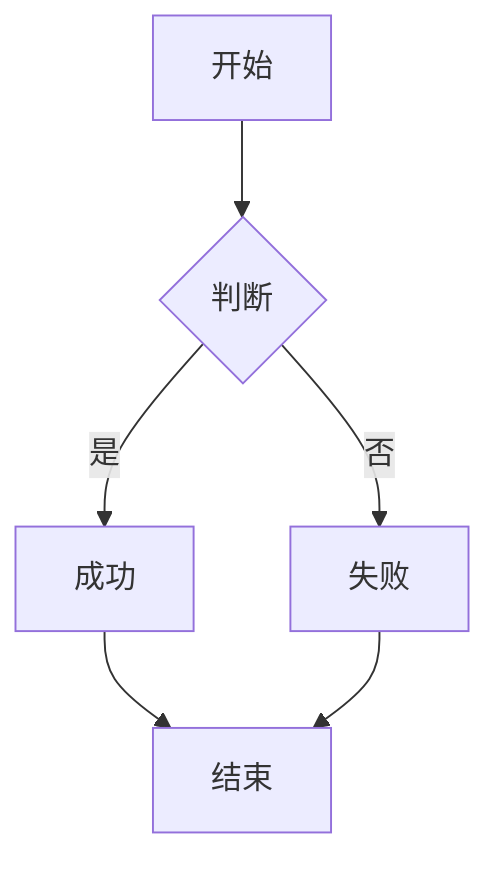

# 🎨 色彩系统预览

> 用于直观查看当前 CSS 色彩系统在浅/深色模式下的实际渲染效果

---

## 1️⃣ 主强调色

**主要用途**：链接、强调文字、代码块左边框、标题强调、按钮 hover、焦点环

| 模式  | 色值        | 预览                                             |
| --- | --------- | ---------------------------------------------- |
| 浅色  | `#5A7F9A` | <span style="color:#5A7F9A">■■■ #5A7F9A</span> |
| 深色  | `#6B9FE8` | <span style="color:#6B9FE8">■■■ #6B9FE8</span> |

**实际渲染**：
- 链接：[这是一个链接](https://example.com)
- 内部链接：[[色彩系统预览]]
- 行内代码：`const primary = '#5A7F9A'`
- 标题强调：见下方标题

---

## 2️⃣ 语义色系完整对比

| 语义 | 用途 | 浅色模式 | 深色模式 | 实时预览 |
|------|------|----------|----------|----------|
| **主强调** | 链接、强调、代码块边框 | `#5A7F9A` | `#6B9FE8` | <span style="color:#5A7F9A">■ #5A7F9A</span> / <span style="color:#6B9FE8">■ #6B9FE8</span> |
| **红/错误** | 危险操作、错误提示 | `#A94E49` | `#FF7881` | <span style="color:#A94E49">■ #A94E49</span> / <span style="color:#FF7881">■ #FF7881</span> |
| **橙/警告** | 警告提示、待办 | `#FFC600` | `#FBBB83` | <span style="color:#FFC600">■ #FFC600</span> / <span style="color:#FBBB83">■ #FBBB83</span> |
| **黄/提示** | 提示、注意 | `#AD8301` | `#FFE88B` | <span style="color:#AD8301">■ #AD8301</span> / <span style="color:#FFE88B">■ #FFE88B</span> |
| **绿/成功** | 成功状态、通过 | `#5A7F9A` | `#6BA3C8` | <span style="color:#5A7F9A">■ #5A7F9A</span> / <span style="color:#6BA3C8">■ #6BA3C8</span> |
| **青/信息** | 信息提示、说明 | `#24837B` | `#86DFE2` | <span style="color:#24837B">■ #24837B</span> / <span style="color:#86DFE2">■ #86DFE2</span> |
| **蓝/主色** | 主题主色 | `#205EA6` | `#89BDF4` | <span style="color:#205EA6">■ #205EA6</span> / <span style="color:#89BDF4">■ #89BDF4</span> |
| **紫/特殊** | 特殊标注、魔法 | `#5E409D` | `#CB9EFF` | <span style="color:#5E409D">■ #5E409D</span> / <span style="color:#CB9EFF">■ #CB9EFF</span> |
| **粉/标注** | 标注、高亮 | `#A02F6F` | `#F2B6DE` | <span style="color:#A02F6F">■ #A02F6F</span> / <span style="color:#F2B6DE">■ #F2B6DE</span> |

---

## 3️⃣ 实时 UI 元素渲染

### 标题层级
# H1 主标题 — 应使用主强调色或深色文字
## H2 二级标题 — 应使用主强调色
### H3 三级标题 — 应使用次级文字色
#### H4 四级标题
##### H5 五级标题
###### H6 六级标题

### 文本样式
- **粗体文字** — `**粗体**`
- *斜体文字* — `*斜体*`
- ~~删除线~~ — `~~删除线~~`
- ==高亮== — `==高亮==` (需插件支持)
- `行内代码` — `` `代码` ``

### 链接
- 外部链接：[GitHub](https://github.com)
- 内部链接：[[色彩系统预览]]
- 脚注引用：[^1]

### 列表
- 无序列表项 1
  - 嵌套项 1.1
  - 嵌套项 1.2
- 无序列表项 2

1. 有序列表项 1
2. 有序列表项 2
   1. 嵌套有序项

- [x] 任务已完成
- [ ] 任务待办
- [ ] 带优先级 ⏫ 高 / 🔼 中 / 🔽 低

### 引用块
> 这是一个标准引用块
> 多行引用测试

> [!NOTE] 信息提示
> 这是一个信息类 Callout

> [!TIP] 小贴士
> 这是一个提示类 Callout

> [!WARNING] 警告
> 这是一个警告类 Callout

> [!DANGER] 危险
> 这是一个危险类 Callout

> [!SUCCESS] 成功
> 这是一个成功类 Callout

### 代码块

```python
# Python 示例
def hello_world():
    print("Hello, World!")
    return "success"

class ColorSystem:
    def __init__(self):
        self.primary = "#5A7F9A"
        self.accent = "#6B9FE8"
```

```javascript
// JavaScript 示例
const colors = {
  primary: "#5A7F9A",
  secondary: "#6B9FE8",
  semantic: {
    red: "#A94E49",
    green: "#5A7F9A",  // 已改为蓝
    blue: "#205EA6"
  }
};
```

### 表格
| 语义 | 浅色 | 深色 | 用途 |
|------|------|------|------|
| 主强调 | #5A7F9A | #6B9FE8 | 链接、强调 |
| 红/错误 | #A94E49 | #FF7881 | 错误、危险 |
| 橙/警告 | #FFC600 | #FBBB83 | 警告 |
| 绿/成功 | #5A7F9A | #6BA3C8 | 成功 |
| 青/信息 | #24837B | #86DFE2 | 信息 |
| 紫/特殊 | #5E409D | #CB9EFF | 特殊标注 |

### 代码块（带行号/高亮）
```css line-numbers
/* CSS 变量定义 */
:root {
  --hv-accent-primary: #5A7F9A;
  --hv-accent-primary-strong: #4A6F8A;
  --hv-color-emphasis: #5A7F9A;
  --hv-color-divider: #5A7F9A;
}
```

### 脚注
这是一个脚注引用[^1]。

[^1]: 这是脚注内容，用于测试脚注颜色。

### 键盘按键
按下 <kbd>Ctrl</kbd> + <kbd>P</kbd> 打开命令面板

### 数学公式
行内公式：$E = mc^2$

块级公式：
$$
\sum_{i=1}^{n} x_i = \frac{1}{n}\sum_{i=1}^{n} x_i
$$

### Mermaid 图表


### 水平分割线
---

---

## 4️⃣ 代码块主题预览

### 浅色模式代码块背景
```text
背景色: #f7f6f3 (浅色)
边框左侧: 3px solid #5A7F9A
文字色: 继承
```

### 深色模式代码块背景
```text
背景色: #1c1e29 (深色)
边框左侧: 3px solid #6B9FE8
文字色: 继承
```

---

## 5️⃣ 当前 CSS 变量实际值快照

### :root (浅色模式)
```css
--hv-accent-primary: #D87757;        /* ⚠️ 实际生效值：暖橙 */
--hv-accent-primary-strong: #C45F40;
--hv-accent-warm: #B45309;
--hv-color-brand: var(--hv-accent-primary);
--hv-color-interactive: var(--hv-accent-primary-strong);
--hv-color-emphasis: #B45309;        /* 暖橙 */
--hv-color-divider: var(--hv-accent-primary);
--hv-inline-code-color: #B45309;
--hv-inline-code-bg: rgba(180, 83, 9, 0.08);
--hv-codeblock-bg: #f7f6f3;
--hv-color-emphasis: #B45309;        /* 实际生效：暖橙 */
--hv-selection-bg: rgba(216, 119, 87, 0.24);
--hv-mark-bg: rgba(57, 212, 83, 0.32);  /* 绿色 mark */
```

### .theme-dark (深色模式)
```css
--hv-color-emphasis: #E2A336;        /* 暖金 */
--hv-inline-code-color: #E2A336;
--hv-inline-code-bg: rgba(226, 163, 54, 0.12);
--hv-codeblock-bg: #1c1e29;
```

> ⚠️ **关键发现**：CSS 里的 `--hv-*` 变量全是硬编码暖色，**完全不读取** Style Settings 的 `#5A7F9A` / `#6B9FE8`。你现在看到的「蓝色」可能只是部分元素被覆盖了，大部分语义色仍是硬编码暖色。

---

## 6️⃣ 如何切换模式测试

1. **设置 → 外观 → 基础颜色** → 切换 `浅色模式` / `深色模式` / `跟随系统`
2. 观察上方所有元素的颜色变化
3. 特别关注：
   - 标题颜色是否变化
   - 链接颜色是否为蓝
   - Callout 左边框颜色
   - 代码块左边框颜色
   - 语义色表格中的色块

---

## 7️⃣ 下一步建议

1. **确认当前实际色系** — 对照上表核对
2. **决定是否要同步所有语义色到蓝色系** — 如需同步，需修改 CSS 源码
3. **决定是否保留暖色语义色（红/橙/黄）** — 警告/错误类通常保留暖色更符合直觉

---

> **文件位置**：`色彩系统预览.md` (Vault 根目录)  
> **用途**：随时切换主题模式、修改 CSS 后刷新此文件对比效果